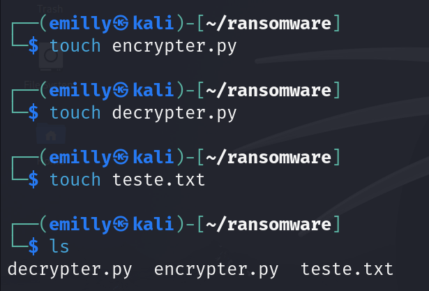
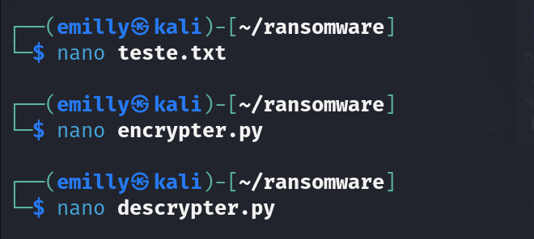
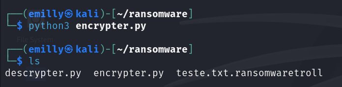
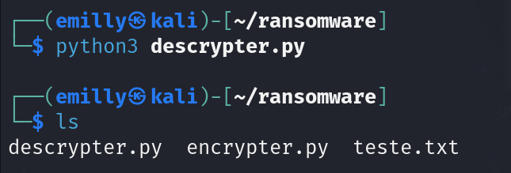

# Ransomware de criptografia

### Configurando o local

- Criar pasta: ```mkdir ransomware```
  


- Criar os arquivos txt e python:
```touch encrypter.py``` ```touch decrypter.py``` ```touch teste.txt```



### Criptografia

- Escrever os códigos e mensagem: ```nano encrypter.py``` ```nano decrypter.py``` ```nano teste.txt```
  


- Encriptografar mensagem: ```python3 encrypter.py```

  

- Descriptografar mensagem: ```python3 decrypter.py```



### Possível erro

- Durante a execução, se o módulo pyaes não estiver instalado no ambiente Python ocorrerar um erro de execução
```ModuleNotFoundError: No module named 'pyaes'```

- Para resolver é preciso instalar o pyaes:
```sudo apt update```
```sudo apt install python3-pip```

- As distribuições Linux mais recentes, incluindo Kali Linux, implementaram políticas que restringem a instalação de pacotes Python diretamente com pip em determinados ambientes.
- Para baixar com o pip utilizasse: ```pip3 install pyaes --break-system-packages```
